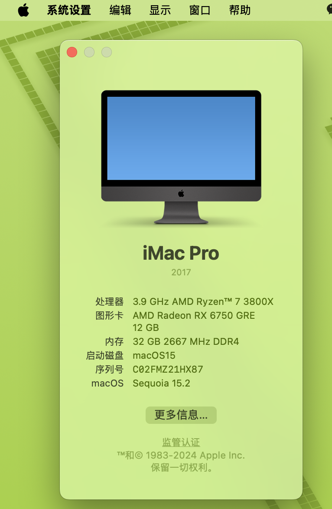

# B450M (MSI) - AMD Ryzen 7 3800X
OpenCore EFI
## System Information

| Name     |                     Model |
| :------- | ------------------------: |
| CPU      |             Ryzen 7 3800X |
| GPU      |               AMD 6750GRE 12G|
| SSD      | 英睿达 MX300 525GB |
| WiFi     |  - |
| Board    |            MSI B450M |
| Ethernet |      Realtek® RTL8111 |

- OpenCore: v1.0.3
- MacOS: v15.2 Sequoia

# ⚠️⚠️⚠️此 EFI 使用注意事项，不看90%扑街⚠️⚠️⚠️

### **1.** 默认config为物理核心数为 `8核` 的AMD CPU使用，如果你是 `4核` 或者 `6核` 及以上的请自行修改，不然无法启动
- 首先，使用任意文本编辑器使用查找功能查找关键词 `Force cpuid_cores_per_package`，一共四个，紧接着找到对应它的键值 `Replace`，根据下方表格修改为对应自己硬件配置的值。

| 核心数 | 数值|
|-|-|
|   4 Core  | `uAQAAAAA` `ugQAAAAA` `ugQAAACQ` `ugQAAAA=`|
|   6 Core  | `uAYAAAAA` `ugYAAAAA` `ugYAAACQ` `ugYAAAA=`|
|   8 Core  | `uAgAAAAA` `uggAAAAA` `uggAAACQ` `uggAAAA=` (默认)|
|   12 Core | `uAwAAAAA` `ugwAAAAA` `ugwAAACQ` `ugwAAAA=`|
|   16 Core | `uBAAAAAA` `uhAAAAAA` `uhAAAACQ` `uhAAAAA=`|

### **2.** 关于 Resizeble BAR 的开启
- Resizeble BAR：应关闭。
- About 4G：应开启。

### **3.** 关于 SIP
- `AAAAAA==`即`00000000` 代表开启 SIP。
- `ZwAAAA==`即`67000000` 代表关闭 SIP。
- 我已开启SIP，目的是为了使用 vbox(6.1.50) 虚拟机运行Windows系统，如果你不需要的话可以开启SIP。将`NVRAM` -> `Add` -> `7C436110-AB2A-4BBB-A880-FE41995C9F82` -> `csr-active-config` 的值更改为`00000000`。

### **4.** 关于 风扇静音
- 请删除 `DeviceProperties` -> `Add` -> `PciRoot(0x0)/Pci(0x3...` -> `PP_PhmSoftPowerPlayTable`，AMD 的显卡有温度阈值，超过 60°风扇才转动，此配置是为了无视阈值，让风扇始终转动。
- 你删除之后可以去B站找如何生成自己显卡的配置的视频教程。

|SIP 状态|unknown (自定义配置)|
|-|-|
|Apple Internal| disabled |
|Kext Signing| disabled |
|Filesystem Protections| disabled |
|Debugging Restrictions| disabled |
|DTrace Restrictions| disabled |
|NVRAM Protections| disabled |
|BaseSystem Verification| enabled |

## 截图

